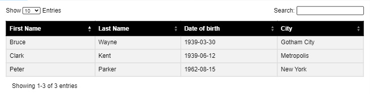
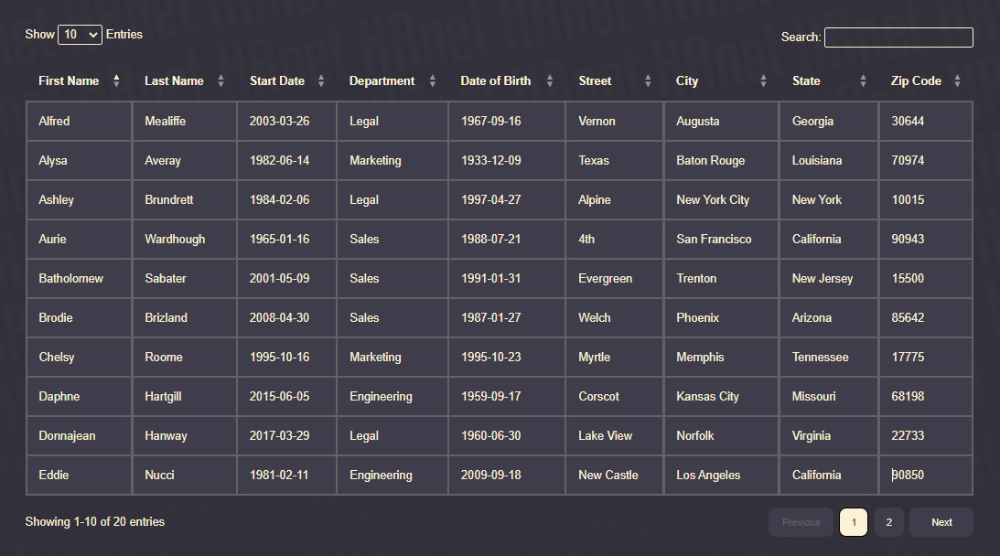

# React Table

A react component to easily create an interactive table.
See full documentation [here](https://rmimekaa.github.io/React-Table/)

#### Features
- Column sorting
- Data search
- Pagination
- Entries counter
- Responsive design

## Installation

Prerequisites: [React](https://fr.reactjs.org/)
```
npm i interactive-react-table
```
-----------------

## Basic Usage Example

Import the component:
```
import { default as ReactTable } from 'interactive-react-table';
```

Set some data:
```
const data = [
  {
    firstName: 'Bruce',
    lastName: 'Wayne',
    birthdate: '1939-03-30',
    city: 'Gotham City'
  },
  {
    firstName: 'Peter',
    lastName: 'Parker',
    birthdate: '1962-08-15',
    city: 'New York'
  },
  {
    firstName: 'Clark',
    lastName: 'Kent',
    birthdate: '1939-06-12',
    city: 'Metropolis'
  }
]
```

Config headers:
```
const headers = [
  {
    name: 'First Name',
    key: 'firstName'
  },
  {
    name: 'Last Name',
    key: 'lastName'
  },
  {
    name: 'Date of birth',
    key: 'birthdate'
  },
  {
    name: 'City',
    key: 'city'
  }
]
```

Use component:
```
<ReactTable data={data} headers={headers} />
```

Render:  


-----------------

## Props

- `data: {Array<Objects>}`  
  - Required
  - The data you want to display in the table.
  - To ensure a good behavior, make sure that each object have the same properties structure.
  
- `headers : {Array<Objects>}`  
  - Required
  - Handle table columns headers.
  - Each object must contain two properties:
    - name : The name to display in the column header
    - key : A string which refers to the corresponding property name. 
  - The items in this array must follow the same order as the data objects properties. 

- `pageSizeOptions : {Array<Numbers>}`  
  - Optional
  - Default: [10, 25, 50]
  - Providing options to configure the number of rows per page.

- `defaultSorting : {Object}`  
  - Optional
  - Default: undefined (No sorting)
  - Provide default sorting settings
  - The object must contains two properties:
    - property : The property you want to sort by
    - order : The sorting order, must be 'ascending' or 'descending'
  - Example : { property : "firstName", order: "ascending" }

- `displayEntries : {Boolean}`  
  - Optional
  - Default: true
  - Disable entries displayer feature by setting it to false

- `allowSearch : {Boolean}`
  - Optional
  - Default: true
  - Disable search feature by setting it to false

- `selectPageSize : {Boolean}`
  - Optional
  - Default: true
  - Disable page size selector feature by setting it to false

-----------------

## Customize Style

Just write some styles for class `.mainContainer` . Your styles will be prioritized over library styles, then target the following selectors to customize what you want.

### Header
  - Container: `.tableHeader `
    - Select page size section: `.selectPageSize` 
    - Search section: `.search` 

### Table
  - Container: `.table` 
    - Table headers (th): `.table-th`  
      You can target a specific header by index using: `.table-th-1`, `.table-th-2`, `.table-th-3`, etc.
    - Table headers content: `.table-th-content` 
    - Sort Icons: `.table-th-sortIcons` 
    - Active sort icon: `.sortIcon--active` 
    - Table rows (tr): `.table-tr`  
      You can target a specific row by index using: `.table-tr-1`, `.table-tr-2`, `.table-tr-3`, etc.
    - Table data cells (td): `.table-td`

### Footer
  - Container: `.tableFooter`
    - Entries displayer: `.entriesDisplayer`
    - Pagination section: `.pagination`
    - Pagination buttons: `.pagination button`
    - Pagination current page button: `.pagination button.currentPage`

#### Example:



Hope it helps !

<p float='left'>
  
  
  
  
</p>